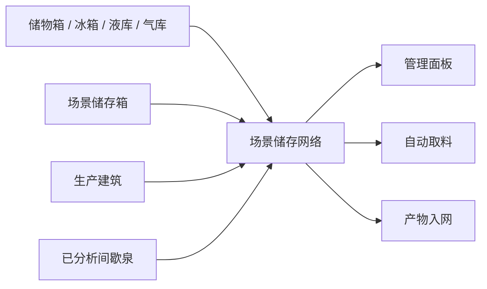

# StorageNetwork 制作案例：从一个网络储物箱到全局物流

这一章用 `StorageNetwork` 模组做一个完整教学案例。

我们不一上来就复刻最终版。最终版包含管理面板、自动取料、成品入网、间歇泉输出、配置界面和世界文字面板，直接抄会很累。更好的学习方式是把它拆成一个可以逐步验证的路线：

1. 做一个天然属于网络的储物箱。
2. 让原版储物箱可以手动加入网络。
3. 扫描当前场景里的网络成员，并缓存成快照。
4. 做一个管理入口查看网络库存。
5. 做一个转运服务，把物品从来源仓库搬到合适目标。
6. 把生产建筑和间歇泉接进这套网络。

读完这一章，你应该能掌握一种中型 Mod 的写法：先做最小闭环，再把功能挂到原版系统上。

::: tip 适合阅读前提
建议先读完 [第一个Mod](./first-mod-tutorial.md)、[Mod 结构](./mod-structure.md) 和 [Harmony 参考](./harmony-reference.md)。这一章默认你已经知道如何创建类库项目、引用游戏 DLL、编译并放入 `mods/Dev`。
:::

---

## 一 . 先看最终效果

`StorageNetwork` 想解决的是一个很常见的痛点：基地里储物箱越来越多，材料分散在各处，生产建筑缺料时还要复制人来回跑。

最终效果可以描述成这样：

* 新增一个“场景储存箱”，它建出来后自动属于储存网络。
* 原版储物箱、冰箱、液库、气库可以通过用户菜单加入网络。
* 管理菜单里新增一个按钮，打开储存网络总览面板。
* 面板能汇总所有网络仓库的库存、容量和分类。
* 生产建筑可以从网络里自动请求材料。
* 生产完成的物品可以自动回收到网络仓库。
* 已分析的间歇泉可以把喷发物直接导入网络。

用图表示，大概是这样：



这不是一个单点 Patch，而是一个小系统。所以我们先不要急着写 UI，先搭系统骨架。

---

## 二 . 推荐项目结构

这个案例可以按职责分目录：

```text
StorageNetwork/
├── ModEntry.cs                         # 模组入口
├── Config.cs                           # 配置读取
├── STRINGS.cs                          # 本地化文本
├── Buildings/
│   └── SceneStorageBoxConfig.cs        # 新增场景储存箱
├── Components/
│   ├── StorageNetworkEnrollment.cs     # 建筑是否加入网络
│   ├── StorageNetworkMaterialRequester.cs
│   └── StorageNetworkGeyserOutput.cs
├── Core/
│   ├── StorageSceneRegistry.cs         # 场景注册表
│   ├── StorageSceneCollector.cs        # 快照收集器
│   ├── StorageNetworkMembership.cs     # 成员判断
│   └── StorageSceneSnapshot.cs         # 快照数据
├── Services/
│   ├── NetworkStorageTransferService.cs
│   └── StorageItemUtility.cs
├── Patches/
│   ├── BuildingRegistrationPatch.cs
│   ├── StorageLockerEnrollmentPatch.cs
│   ├── ComplexRecipeBuildingEnrollmentPatch.cs
│   └── SideScreenPatch.cs
└── UI/
    └── StorageNetworkPanel.cs
```

可以把它记成一句话：

`Patches` 负责接入游戏，`Components` 负责挂在对象上保存状态，`Core` 负责维护网络数据，`Services` 负责业务逻辑，`UI` 只负责展示和交互。

这是中型 Mod 最重要的一步。分层清楚，后面扩展不会乱。

---

## 三 . 第一步：模组入口只做初始化

先写入口：

```csharp
using HarmonyLib;
using KMod;
using StorageNetwork.Core;

namespace StorageNetwork
{
    public class ModEntry : UserMod2
    {
        public override void OnLoad(Harmony harmony)
        {
            base.OnLoad(harmony);
            StorageNetworkSprites.SetModPath(mod.ContentPath);
            StorageNetworkAssetBundles.SetModPath(mod.ContentPath);
            StorageNetworkLocalization.SetModPath(mod.ContentPath);
            Config.SetModPath(mod.ContentPath);
            Config.Load();
            StorageNetworkOptions.Register();
        }
    }
}
```

这里有个原则：`OnLoad` 只做初始化，不扫描场景，不找建筑，不操作存档对象。

因为 `OnLoad` 执行时，游戏世界还没完全生成。你在这里 `FindObjectsByType<Storage>()`，要么找不到，要么找到的不是你真正想处理的场景对象。

入口阶段适合做这些事：

* 记录 `mod.ContentPath`。
* 加载配置。
* 准备图片、AssetBundle、本地化路径。
* 注册 Mod 选项。
* 让 Harmony 自动应用补丁。

---

## 四 . 第二步：做一个天然入网的储物箱

最小闭环从一个新建筑开始。因为新建筑完全由我们控制，最容易验证。

目标是新增一个 `SceneStorageBox`：

* 外观先复用原版储物箱动画。
* 本质上是一个 `Storage`。
* 建成后自动属于储存网络。
* 能出现在建造菜单和科技树里。

### 1. 定义建筑

新建 `Buildings/SceneStorageBoxConfig.cs`：

```csharp
using StorageNetwork.Components;
using StorageNetwork.Core;
using TUNING;
using UnityEngine;

namespace StorageNetwork.Buildings
{
    public class SceneStorageBoxConfig : IBuildingConfig
    {
        public const string ID = "StorageNetworkSceneStorageBox";

        public override BuildingDef CreateBuildingDef()
        {
            BuildingDef def = BuildingTemplates.CreateBuildingDef(
                ID,
                1,
                2,
                "storagelocker_kanim",
                30,
                10f,
                BUILDINGS.CONSTRUCTION_MASS_KG.TIER4,
                MATERIALS.RAW_MINERALS_OR_METALS,
                1600f,
                BuildLocationRule.OnFloor,
                BUILDINGS.DECOR.PENALTY.TIER1,
                NOISE_POLLUTION.NONE,
                0.2f);

            def.Floodable = false;
            def.Overheatable = false;
            def.AudioCategory = "Metal";
            return def;
        }
    }
}
```

这一步只是在告诉游戏：我要新增一个建筑，它几格宽、几格高、用什么动画、用什么材料、能不能被淹。

### 2. 给建筑加 Storage

继续补 `ConfigureBuildingTemplate`：

```csharp
public override void ConfigureBuildingTemplate(GameObject go, Tag prefabTag)
{
    KPrefabID prefabId = go.GetComponent<KPrefabID>();
    prefabId?.AddTag(StorageSceneTags.SceneStorageBox);

    Storage storage = go.AddOrGet<Storage>();
    storage.capacityKg = Config.Instance.SceneStorageBoxCapacityKg;
    storage.showInUI = true;
    storage.allowItemRemoval = true;
    storage.showDescriptor = true;
    storage.storageFilters = STORAGEFILTERS.STORAGE_LOCKERS_STANDARD;
    storage.fetchCategory = Storage.FetchCategory.GeneralStorage;
    storage.showCapacityStatusItem = true;
    storage.showCapacityAsMainStatus = true;

    go.AddOrGet<SceneStorageBoxMarker>();
    go.AddOrGet<StorageLocker>();
    go.AddOrGet<UserNameable>();
    go.AddOrGet<CopyBuildingSettings>().copyGroupTag = GameTags.StorageLocker;
}
```

这里有三个关键点：

* `Storage` 决定它真的能存东西。
* `StorageSceneTags.SceneStorageBox` 和 `SceneStorageBoxMarker` 用来判断它属于网络。
* `StorageLocker`、`UserNameable`、`CopyBuildingSettings` 让它更像原版储物箱。

`DoPostConfigureComplete` 里再补储物箱控制器：

```csharp
public override void DoPostConfigureComplete(GameObject go)
{
    go.AddOrGetDef<StorageController.Def>();
}
```

### 3. 注册到建造菜单和科技树

新建 `Patches/BuildingRegistrationPatch.cs`：

```csharp
using HarmonyLib;
using StorageNetwork.Buildings;

namespace StorageNetwork.Patches
{
    public static class BuildingRegistrationPatch
    {
        [HarmonyPatch(typeof(GeneratedBuildings), "LoadGeneratedBuildings")]
        public static class LoadGeneratedBuildingsPatch
        {
            public static void Prefix()
            {
                ModUtil.AddBuildingToPlanScreen("Base", SceneStorageBoxConfig.ID);
            }
        }

        [HarmonyPatch(typeof(Db), "Initialize")]
        public static class DbInitializePatch
        {
            public static void Postfix()
            {
                Tech tech = Db.Get().Techs.Get("SmartStorage");
                if (tech != null && !tech.unlockedItemIDs.Contains(SceneStorageBoxConfig.ID))
                {
                    tech.unlockedItemIDs.Add(SceneStorageBoxConfig.ID);
                }
            }
        }
    }
}
```

到这里先编译进游戏验证：

1. 建造菜单里能看到新建筑。
2. 研究智能存储后能解锁。
3. 建出来后能打开储物箱 UI。
4. 能设置过滤器，能存东西。

这就是第一个最小闭环。

---

## 五 . 第三步：让原版建筑可以加入网络

接下来要处理原版建筑。玩家选择一个储物箱时，用户菜单里出现“加入储存网络”按钮；点一下，状态保存到存档。

这个状态应该放在组件里。

### 1. 编写接入组件

新建 `Components/StorageNetworkEnrollment.cs`：

```csharp
using KSerialization;
using StorageNetwork.Core;
using UnityEngine;

namespace StorageNetwork.Components
{
    public sealed class StorageNetworkEnrollment : KMonoBehaviour
    {
        [Serialize]
        public bool IncludedInSceneNetwork;

        [MyCmpGet]
        private Storage storage = null;

        protected override void OnSpawn()
        {
            base.OnSpawn();
            StorageSceneRegistry.Register(gameObject);
            Subscribe((int)GameHashes.RefreshUserMenu, OnRefreshUserMenuDelegate);
            RefreshConnectedStatus();
        }

        protected override void OnCleanUp()
        {
            StorageSceneRegistry.Unregister(gameObject);
            base.OnCleanUp();
        }
    }
}
```

`[Serialize]` 是这里的灵魂。没有它，玩家点了加入网络，存档再读回来就丢了。

### 2. 添加用户菜单按钮

继续补按钮逻辑：

```csharp
private static readonly EventSystem.IntraObjectHandler<StorageNetworkEnrollment> OnRefreshUserMenuDelegate =
    new EventSystem.IntraObjectHandler<StorageNetworkEnrollment>((component, data) => component.OnRefreshUserMenu(data));

private void OnRefreshUserMenu(object data)
{
    if (!CanShowEnrollmentButton())
    {
        return;
    }

    string name = IncludedInSceneNetwork ? "移出储存网络" : "加入储存网络";
    string tooltip = IncludedInSceneNetwork ? "不再计入储存网络" : "加入当前场景储存网络";

    KIconButtonMenu.ButtonInfo button = new KIconButtonMenu.ButtonInfo(
        "action_switch_toggle",
        name,
        ToggleEnrollment,
        global::Action.NumActions,
        null,
        null,
        null,
        tooltip,
        true);

    Game.Instance.userMenu.AddButton(gameObject, button, 1f);
}

private void ToggleEnrollment()
{
    SetIncludedInSceneNetwork(!IncludedInSceneNetwork);
}
```

切换状态时要刷新网络缓存：

```csharp
public void SetIncludedInSceneNetwork(bool included)
{
    if (IncludedInSceneNetwork == included)
    {
        return;
    }

    IncludedInSceneNetwork = included;
    StorageSceneRegistry.Invalidate();
    RefreshConnectedStatus();
    KMonoBehaviour.PlaySound(GlobalAssets.GetSound("HUD_Click", false));
}
```

### 3. 把组件挂到原版储物箱

用 Harmony 挂到原版配置类：

```csharp
using HarmonyLib;
using StorageNetwork.Components;
using UnityEngine;

namespace StorageNetwork.Patches
{
    public static class StorageLockerEnrollmentPatch
    {
        [HarmonyPatch(typeof(StorageLockerConfig), nameof(StorageLockerConfig.ConfigureBuildingTemplate))]
        public static class StorageLockerConfigConfigureBuildingTemplatePatch
        {
            public static void Postfix(GameObject go)
            {
                go.AddOrGet<StorageNetworkEnrollment>();
            }
        }
    }
}
```

现在再次进游戏验证：

1. 建一个原版储物箱。
2. 选中它。
3. 用户菜单出现“加入储存网络”。
4. 点击后状态变化。
5. 存档、读档，状态仍然保留。

如果你做到这里，就已经掌握了很多 ONI Mod 的核心套路：`Harmony Patch` 给原版对象挂自定义 `KMonoBehaviour`，再用 `[Serialize]` 保存状态。

---

## 六 . 第四步：建立网络成员判断

现在有两类网络成员：

* 新增的 `SceneStorageBox`，它天然属于网络。
* 原版建筑，玩家手动加入后属于网络。

不要在每个地方都写一遍判断。新建 `Core/StorageNetworkMembership.cs`：

```csharp
using StorageNetwork.Components;
using UnityEngine;

namespace StorageNetwork.Core
{
    public static class StorageNetworkMembership
    {
        public static bool IsNetworkMember(GameObject candidate, out string reason)
        {
            if (candidate == null)
            {
                reason = "no selection";
                return false;
            }

            if (candidate.GetComponent<SceneStorageBoxMarker>() != null)
            {
                reason = "scene storage marker";
                return true;
            }

            KPrefabID prefabId = candidate.GetComponent<KPrefabID>();
            if (prefabId != null && prefabId.HasTag(StorageSceneTags.SceneStorageBox))
            {
                reason = "scene storage tag";
                return true;
            }

            StorageNetworkEnrollment enrollment = candidate.GetComponent<StorageNetworkEnrollment>();
            if (enrollment != null && enrollment.IncludedInSceneNetwork)
            {
                reason = "included in network";
                return true;
            }

            reason = "not StorageNetwork object";
            return false;
        }
    }
}
```

这一步看起来很普通，但它决定了后续代码会不会乱。

以后 UI、转运服务、生产建筑请求材料，都只问这个入口：“它是不是网络成员？”而不是各写各的判断条件。

---

## 七 . 第五步：做场景注册表和快照

你可能会想：打开面板时直接 `Object.FindObjectsByType<Storage>()` 不就行了吗？

少量建筑可以。到了后期基地，UI 高频刷新会明显增加开销。更好的办法是：

1. 建筑生成时注册进表。
2. 建筑销毁时移出表。
3. UI 读取缓存快照。
4. 加入/移出网络时让快照失效。

### 1. 注册表

新建 `Core/StorageSceneRegistry.cs`：

```csharp
using System.Collections.Generic;
using UnityEngine;

namespace StorageNetwork.Core
{
    public static class StorageSceneRegistry
    {
        private static readonly HashSet<Storage> Storages = new HashSet<Storage>();
        private static int version;

        public static int Version => version;

        public static void Register(GameObject gameObject)
        {
            Storage storage = gameObject != null ? gameObject.GetComponent<Storage>() : null;
            if (storage != null && Storages.Add(storage))
            {
                Invalidate();
            }
        }

        public static void Unregister(GameObject gameObject)
        {
            Storage storage = gameObject != null ? gameObject.GetComponent<Storage>() : null;
            if (storage != null && Storages.Remove(storage))
            {
                Invalidate();
            }
        }

        public static IReadOnlyCollection<Storage> GetStorages()
        {
            PruneDeadEntries();
            return Storages;
        }

        public static void Invalidate()
        {
            version++;
            StorageSceneCollector.InvalidateCache();
        }

        private static void PruneDeadEntries()
        {
            if (Storages.RemoveWhere(storage => storage == null || storage.gameObject == null) > 0)
            {
                Invalidate();
            }
        }
    }
}
```

`version` 是一个很实用的小技巧。只要注册表变化，版本号递增。收集器发现版本号没变，就可以继续用旧快照。

### 2. 快照数据

新建一个简单模型：

```csharp
using System.Collections.Generic;

namespace StorageNetwork.Core
{
    public sealed class StorageSceneSnapshot
    {
        public StorageSceneSnapshot(IReadOnlyList<StorageInfo> storages, float totalStoredKg, float totalCapacityKg)
        {
            Storages = storages;
            TotalStoredKg = totalStoredKg;
            TotalCapacityKg = totalCapacityKg;
        }

        public IReadOnlyList<StorageInfo> Storages { get; }
        public float TotalStoredKg { get; }
        public float TotalCapacityKg { get; }
    }
}
```

`StorageInfo` 可以包装单个仓库的名字、容量、已存质量和物品列表。实际项目里它会更长，但教学阶段先把它当成“UI 友好的仓库数据”即可。

### 3. 收集器

新建 `Core/StorageSceneCollector.cs`：

```csharp
using System.Collections.Generic;
using UnityEngine;

namespace StorageNetwork.Core
{
    public static class StorageSceneCollector
    {
        private static StorageSceneSnapshot cachedSnapshot;
        private static int cachedRegistryVersion = -1;

        public static StorageSceneSnapshot Collect(bool force = false)
        {
            int registryVersion = StorageSceneRegistry.Version;
            if (!force && cachedSnapshot != null && cachedRegistryVersion == registryVersion)
            {
                return cachedSnapshot;
            }

            List<StorageInfo> collected = new List<StorageInfo>();
            float totalStoredKg = 0f;
            float totalCapacityKg = 0f;

            foreach (Storage storage in StorageSceneRegistry.GetStorages())
            {
                if (!StorageNetworkMembership.IsNetworkMember(storage.gameObject, out _))
                {
                    continue;
                }

                StorageInfo info = new StorageInfo(storage);
                collected.Add(info);
                totalStoredKg += info.StoredKg;
                totalCapacityKg += info.CapacityKg;
            }

            cachedSnapshot = new StorageSceneSnapshot(collected, totalStoredKg, totalCapacityKg);
            cachedRegistryVersion = registryVersion;
            return cachedSnapshot;
        }

        public static void InvalidateCache()
        {
            cachedSnapshot = null;
            cachedRegistryVersion = -1;
        }
    }
}
```

现在你已经拥有了“储存网络”的核心数据层。UI 还没写，但系统已经能回答：

* 当前有哪些网络仓库？
* 总容量是多少？
* 已存质量是多少？
* 哪些建筑不属于网络？

---

## 八 . 第六步：做一个最简管理入口

最终版 `StorageNetworkPanel` 是一套完整 UI。教学阶段可以先做一个简化版：点管理菜单按钮，打开面板或先打印日志。

接入点是 `ManagementMenu.OnPrefabInit`：

```csharp
using HarmonyLib;
using StorageNetwork.UI;
using UnityEngine;

namespace StorageNetwork.Patches
{
    public static class SideScreenPatch
    {
        [HarmonyPatch(typeof(ManagementMenu), "OnPrefabInit")]
        public static class ManagementMenuOnPrefabInitPatch
        {
            public static void Postfix(ManagementMenu __instance)
            {
                if (__instance == null)
                {
                    return;
                }

                StorageNetworkManagementButton.Add(__instance);
            }
        }
    }
}
```

实际项目里的按钮是复制原版 `KToggle`：

```csharp
KToggle template = ResolveTemplate(menu);
GameObject buttonObject = Object.Instantiate(template.gameObject, parent, false);
buttonObject.name = "StorageNetworkManagementButton";

KToggle button = buttonObject.GetComponent<KToggle>();
button.ClearOnClick();
button.group = null;
button.isOn = false;
button.interactable = true;

button.onClick += () =>
{
    button.isOn = false;
    KMonoBehaviour.PlaySound(GlobalAssets.GetSound("HUD_Click", false));
    StorageNetworkPanel.Show();
};
```

为什么复制原版按钮，而不是自己创建一个空物体？

因为原版按钮已经有正确的层级、字体、缩放、鼠标状态、音效、图标结构。UI 补丁里能复用模板就复用模板，会省很多奇怪的对齐问题。

管理面板里最先显示三样东西就够了：

```csharp
StorageSceneSnapshot snapshot = StorageSceneCollector.Collect();
string stored = GameUtil.GetFormattedMass(snapshot.TotalStoredKg);
string capacity = GameUtil.GetFormattedMass(snapshot.TotalCapacityKg);
int count = snapshot.Storages.Count;
```

先能看到“网络仓库数量、总库存、总容量”，再逐步加分类、搜索、排序、拖拽、生产设置。

---

## 九 . 第七步：做物品转运服务

现在进入真正的物流部分。

不要把转运逻辑写进 UI，也不要写进按钮事件。新建 `Services/NetworkStorageTransferService.cs`，让它专门负责搬东西。

对外先暴露两个方法：

```csharp
public static StorageTransferResult TransferStoredItemsToNetwork(
    Storage source,
    IEnumerable<Storage> excludedStorages,
    Storage specificTarget = null)

public static StorageTransferResult TransferLooseItemToNetwork(
    GameObject item,
    IEnumerable<Storage> excludedStorages,
    Storage specificTarget = null)
```

第一个用于“从某个仓库把东西转进网络”。第二个用于“地上的散落物或刚生产出来的物品转进网络”。

目标仓库选择规则可以先做成这样：

```csharp
private static bool IsUsableOutputTarget(
    Storage target,
    GameObject item,
    HashSet<Tag> matchTags,
    HashSet<Storage> excludedStorages)
{
    return target != null &&
           !excludedStorages.Contains(target) &&
           target.GetComponent<ComplexFabricator>() == null &&
           target.RemainingCapacity() > PICKUPABLETUNING.MINIMUM_PICKABLE_AMOUNT &&
           IsStorageAccepting(target, matchTags) &&
           (target.items == null || !target.items.Contains(item));
}
```

然后按优先级找目标：

1. 如果用户指定了目标箱子，只尝试这个箱子。
2. 否则扫描网络快照。
3. 优先选择已经存有同类物品的仓库。
4. 同类物品数量相同，再选过滤器明确接受该物品的仓库。
5. 还相同，再选剩余容量更大的仓库。

这个排序能让玩家感觉网络在“聪明地整理”，而不是随机乱塞。

储存类 Mod 最容易踩的坑是过滤器。ONI 的过滤器不只有具体物品标签，还有分类标签。例如玩家勾选的是“金属矿石”，物品本身可能是 `CopperOre`。所以判断时要同时考虑：

* `Storage.storageFilters`
* `TreeFilterable.AcceptedTags`
* `DiscoveredResources.Instance.GetDiscoveredResourcesFromTag(categoryTag)`

这就是为什么转运逻辑要独立成 `Services`。它会越来越复杂，放在 UI 里会很痛苦。

---

## 十 . 第八步：生产建筑自动取料

生产建筑接入网络后，最有价值的功能是自动补料。

实现方式：给所有 `ComplexFabricator` 挂一个 `StorageNetworkMaterialRequester` 组件。

补丁入口：

```csharp
[HarmonyPatch(typeof(GeneratedBuildings), "LoadGeneratedBuildings")]
public static class LoadGeneratedBuildingsPatch
{
    public static void Postfix()
    {
        foreach (GameObject prefab in Assets.GetPrefabsWithComponent<ComplexFabricator>())
        {
            if (prefab != null && prefab.GetComponent<Storage>() != null)
            {
                prefab.AddOrGet<StorageNetworkEnrollment>();
                prefab.AddOrGet<StorageNetworkMaterialRequester>();
            }
        }
    }
}
```

组件里每秒检查一次：

```csharp
public sealed class StorageNetworkMaterialRequester : KMonoBehaviour, ISim1000ms
{
    [Serialize]
    public bool RequestEnabled;

    [Serialize]
    public int SourceStorageInstanceId = KPrefabID.InvalidInstanceID;

    [MyCmpGet]
    private ComplexFabricator fabricator;

    public void Sim1000ms(float dt)
    {
        if (!RequestEnabled || fabricator == null || fabricator.inStorage == null)
        {
            return;
        }

        ComplexRecipe recipe = GetRecipeToRequest();
        if (recipe == null)
        {
            return;
        }

        foreach (ComplexRecipe.RecipeElement ingredient in recipe.ingredients)
        {
            RequestIngredient(recipe, ingredient.material, ingredient.amount);
        }
    }
}
```

真实项目里还做了这些增强：

* `RequestEnabled` 控制是否启用。
* `LimitEnabled` 和 `LimitKg` 控制单次或累计请求上限。
* `RequestedKg` 保存已请求数量。
* `SourceStorageInstanceId` 支持指定来源箱子。
* 无限队列不会一次请求无限材料，而是按配置批量请求。
* 请求失败时加冷却，避免每秒疯狂扫网络。
* 用状态条告诉玩家当前缺什么。

教学阶段可以先只做“当前订单缺什么，就从网络找什么”，然后再补这些保护。

---

## 十一 . 第九步：生产完成后产物入网

自动取料解决的是输入，产物入网解决的是输出。

原版生产建筑生成成品时会调用 `ComplexFabricator.SpawnOrderProduct`。我们用 Postfix 拿到生成结果：

```csharp
using System.Collections.Generic;
using HarmonyLib;
using StorageNetwork.Components;
using UnityEngine;

namespace StorageNetwork.Patches
{
    public static class ComplexFabricatorOutputStorePatch
    {
        [HarmonyPatch(typeof(ComplexFabricator), "SpawnOrderProduct")]
        public static class SpawnOrderProductPatch
        {
            public static void Postfix(ComplexFabricator __instance, List<GameObject> __result)
            {
                StorageNetworkMaterialRequester requester = __instance != null
                    ? __instance.GetComponent<StorageNetworkMaterialRequester>()
                    : null;

                requester?.ForceStoreProducedOutputs(__result);
            }
        }
    }
}
```

这里必须用 Postfix。原因很简单：原版方法执行前，产物还没生成；原版方法执行后，`__result` 里才有可以转运的物品。

`ForceStoreProducedOutputs` 里复用前面写好的转运服务：

```csharp
foreach (GameObject output in producedOutputs)
{
    NetworkStorageTransferService.TransferLooseItemToNetwork(
        output,
        GetFabricatorStorages(),
        GetSpecificOutputTarget());
}
```

`GetFabricatorStorages()` 用来排除生产建筑自己的 `inStorage`、`buildStorage`、`outStorage`，避免刚取出来又塞回自己。

---

## 十二 . 第十步：间歇泉接入网络

间歇泉比储物箱特殊。它没有普通 `Storage`，产物来自 `ElementEmitter`。

这个功能可以拆成三步：

1. 给间歇泉挂 `StorageNetworkEnrollment`。
2. 只允许已分析的间歇泉接入网络。
3. 喷发时找到能接收该元素的网络仓库。

挂组件的补丁：

```csharp
[HarmonyPatch(
    typeof(GeyserGenericConfig),
    nameof(GeyserGenericConfig.CreateGeyser),
    new[]
    {
        typeof(string),
        typeof(string),
        typeof(int),
        typeof(int),
        typeof(string),
        typeof(string),
        typeof(HashedString),
        typeof(float),
        typeof(string[]),
        typeof(string[])
    })]
public static class GeyserGenericConfigCreateGeyserPatch
{
    public static void Postfix(GameObject __result)
    {
        AddGeyserEnrollment(__result);
    }
}
```

判断是否已分析：

```csharp
public bool IsAnalyzedGeyser()
{
    Studyable studyable = GetComponent<Studyable>();
    return IsGeyser() && studyable != null && studyable.Studied;
}
```

这个限制很有必要。原版游戏里，间歇泉在分析前就有一层未知感。如果 Mod 绕过这个限制，玩家会觉得它破坏了游戏规则。

---

## 十三 . 存档引用：保存 ID，不保存对象

生产建筑支持“指定来源箱子”“指定产物目标箱子”。这类设置不要直接保存 `Storage` 对象。

正确思路是保存 `KPrefabID.InstanceID`：

```csharp
[Serialize]
public int SourceStorageInstanceId = KPrefabID.InvalidInstanceID;

public void SetSourceStorage(Storage storage)
{
    SourceStorageInstanceId = GetStorageInstanceId(storage);
}
```

需要使用时，再从当前快照解析：

```csharp
public Storage ResolveSourceStorage()
{
    foreach (StorageInfo info in StorageSceneCollector.Collect().Storages)
    {
        Storage storage = info?.Storage;
        if (GetStorageInstanceId(storage) == SourceStorageInstanceId)
        {
            return storage;
        }
    }

    return null;
}
```

这样做的好处是：读档后对象重新生成，直接引用可能失效，但 `InstanceID` 可以重新映射到当前场景对象。

---

## 十四 . 推荐实现顺序

如果你想照着做一个自己的版本，推荐按这个顺序推进：

1. 新建项目，写 `ModEntry`。
2. 写 `SceneStorageBoxConfig`，让新建筑能建造、能储物。
3. 写 `BuildingRegistrationPatch`，把建筑加进菜单和科技。
4. 写 `StorageNetworkEnrollment`，先只保存 `IncludedInSceneNetwork`。
5. 给原版 `StorageLockerConfig` 挂接入组件。
6. 做用户菜单按钮，能加入/移出网络。
7. 写 `StorageNetworkMembership`，统一判断成员。
8. 写 `StorageSceneRegistry` 和 `StorageSceneCollector`。
9. 用日志或简易 UI 打印网络仓库数量。
10. 写 `NetworkStorageTransferService`，先支持仓库到仓库搬运。
11. 给 `ComplexFabricator` 挂自动取料组件。
12. Patch `SpawnOrderProduct`，实现产物入网。
13. 最后再做完整 UI、配置、多语言和图标。

每一步都能单独进游戏验证。不要等全部写完再启动游戏，那样排错会非常痛。

---

## 十五 . 常见问题

### 按钮不显示

先确认组件是否真的挂上了。可以在 `OnSpawn` 里临时打日志：

```csharp
Debug.Log("[StorageNetwork] Enrollment spawned on " + gameObject.GetProperName());
```

如果组件没挂上，检查 Harmony Patch 的目标方法是否正确。储物箱、冰箱、液库、气库使用的配置类和生命周期方法不完全一样。

### 状态读档后丢失

检查字段有没有 `[Serialize]`。ONI 的组件存档不会自动保存普通字段。

### 面板数据不刷新

检查加入/移出网络、建筑生成、建筑销毁时有没有调用：

```csharp
StorageSceneRegistry.Invalidate();
```

如果注册表版本号不变，收集器会继续返回旧快照。

### 物品转运到奇怪的地方

优先检查过滤器判断。只判断 `storageFilters.Contains(tag)` 不够，要考虑分类标签和 `TreeFilterable`。

### 生产建筑重复统计库存

生产建筑内部可能有多个 `Storage`。统计网络库存时，要限制只统计主要输入仓库，或者显式排除 `buildStorage`、`outStorage`。最终版里用 `StorageNetworkStorageRules.IsPrimaryComplexFabricatorStorage(storage)` 处理这个问题。

---

## 十六 . 这个案例真正想教什么

`StorageNetwork` 的代码量不小，但它背后的方法很朴素：

* 先做一个完全可控的新建筑，建立最小闭环。
* 再给原版建筑挂组件，用 `[Serialize]` 保存玩家选择。
* 用统一入口判断成员，别让规则散落在各处。
* 用注册表和快照支撑 UI 高频刷新。
* 把转运规则放进服务层，让 UI 和组件都能复用。
* 生产建筑、间歇泉这类高级功能，都是在同一个网络核心上继续扩展。

学会这个结构后，你可以做很多类似 Mod：全局库存面板、自动补料系统、智能整理仓库、建筑分组管理、按条件收集场景对象。它们本质上都是“给对象挂状态，收集成快照，再用服务层处理规则”。

